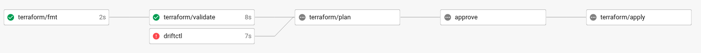

You can integrate driftctl in CircleCI by using the [official orb](https://circleci.com/developer/orbs/orb/snyk/driftctl).

```yml
version: '2.1'
orbs:
  driftctl: snyk/driftctl@1
```

You can integrate driftctl within your GitOps workflow to get something like this:


In this kind of workflow if a new drift happens it will block your pipeline execution:




## Full example

Below you can find a full CircleCI example with a complete GitOps workflow example and a scheduled run of driftctl.

```yml
version: '2.1'

orbs:
  driftctl: snyk/driftctl@1
  terraform: circleci/terraform@1

jobs:
  driftctl:
    executor: driftctl/default
    environment:
      DCTL_NO_VERSION_CHECK: 'true'
      DCTL_FILTER: "Type=='aws_instance'"
    steps:
      - checkout # This step may be optional
      - driftctl/install:
          version: v0.6.0
      - driftctl/scan

workflows:
  # This workflow schedules driftctl every 10 minutes
  drift_monitoring:
    triggers:
      - schedule:
          cron: "0,10,20,30,40,50 * * * *"
          filters:
            branches:
              only:
                - master
    jobs:
      - driftctl:
          context: test-orb-driftctl
  # The workflow below is an example to integrate driftctl in your GitOps pipeline
  deploy_infrastructure:
    jobs:
      - driftctl:
          context: test-orb-driftctl
      - terraform/fmt:
          checkout: true
          context: test-orb-terraform
      - terraform/validate:
          checkout: true
          context: test-orb-terraform
          requires:
            - terraform/fmt
      - terraform/plan:
          checkout: true
          context: test-orb-terraform
          persist-workspace: true
          requires:
            - terraform/validate
            - driftctl
      - approve:
          type: approval
          requires:
            - terraform/plan
      - terraform/apply:
          attach-workspace: true
          context: test-orb-terraform
          requires:
            - approve
```